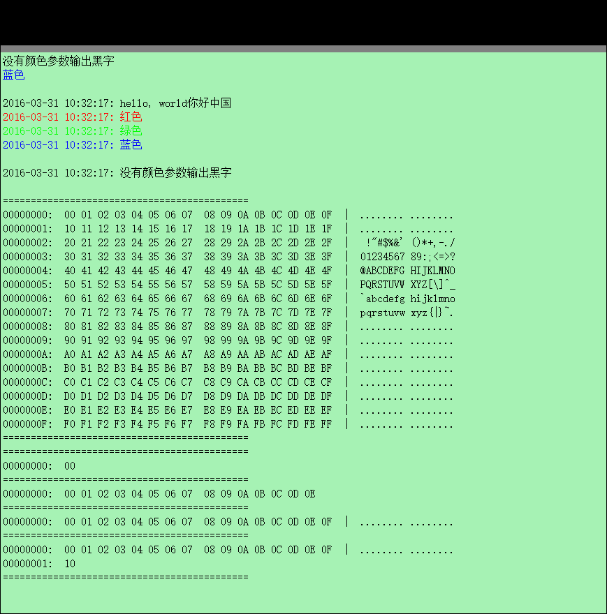

示例：
==============
	// 无时间头，裸输出
	XTRACE.print("没有颜色参数输出黑字\n");
	XTRACE.print(System.Drawing.Color.FromArgb(0, 0, 255), "蓝色\n\n");
	
	// 带颜色输出，有时间头
	XTRACE.printex(System.Drawing.Color.FromArgb(0, 0, 0), "hello, world你好中国\n");
	XTRACE.printex(System.Drawing.Color.FromArgb(255, 0, 0), "红色\n");
	XTRACE.printex(System.Drawing.Color.FromArgb(0, 255, 0), "绿色\n");
	XTRACE.printex(System.Drawing.Color.FromArgb(0, 0, 255), "蓝色\n\n");
	
	// 不带颜色输出，有时间头
	XTRACE.printex("没有颜色参数输出黑字\n\n");
	
	// 二进制数据打印
	byte[] testprint = new byte[256];
	for(int i = 0; i < 256; i++)
	{
	    testprint[i] = (byte)i;
	}
	XTRACE.print("============================================\n");
	XTRACE.print(testprint, 256);
	XTRACE.print("============================================\n");
	XTRACE.print(testprint, 0);
	XTRACE.print("============================================\n");
	XTRACE.print(testprint, 1);
	XTRACE.print("============================================\n");
	XTRACE.print(testprint, 15);
	XTRACE.print("============================================\n");
	XTRACE.print(testprint, 16);
	XTRACE.print("============================================\n");
	XTRACE.print(testprint, 17);
	XTRACE.print("============================================\n");

结果：
===========

